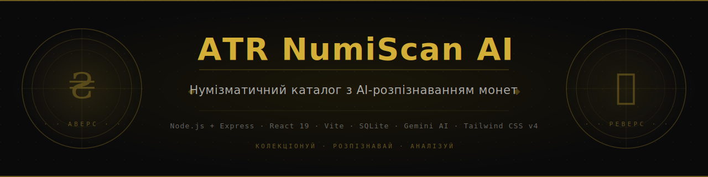

<p align="center">
  
</p>

<p align="center">
  
  
  
  
  
  
</p>

<p align="center">
  Персональний нумізматичний каталог з AI-розпізнаванням монет через Google Gemini API.<br/>
  Завантаж фото — отримай повний опис, країну, метал, рік карбування та ринкову вартість.
</p>

---

## Можливості

- **AI-розпізнавання** — ідентифікація монети по одному або двом фото (аверс + реверс) через Gemini API
- **Автокорекція порядку фото** — AI визначає чи аверс і реверс переплутані місцями та виправляє автоматично
- **Перевірка дублів** — попередження при спробі додати вже наявну монету
- **Перемикач моделі Gemini** у інтерфейсі (2.0 Flash, 1.5 Pro та ін.), вибір зберігається між сесіями
- **Фільтрація за сплавами** — групові категорії (Біметал, Срібло, Бронза, Латунь, Сталь…)
- **Пагінація каталогу** — 60 монет на сторінку, навігація клавішами `Ctrl+→` / `Ctrl+←`
- **Ліниве завантаження зображень** — фото роздаються через URL-ендпоїнт, кешуються браузером
- **Детальна картка монети** — редагування всіх полів, категорії, нотатки, збільшення фото
- **Карта світу** — choropleth із градієнтним заповненням країн за кількістю монет
- **Статистика колекції** — десятиліття, метали, країни, рідкість, грейди, категорії
- **Прапори та ISO-коди** — 100+ країн, включно з історичними (СРСР, НДР, Кайзерейх тощо)
- **Особисті категорії** — 10 кольорових міток для власної класифікації
- **REST API** — повний доступ до каталогу ззовні

---

## Стек

| Шар | Технологія |
|---|---|
| Backend | Node.js + Express + TypeScript (`tsx`) |
| Frontend | React 19 + Vite 6 + Tailwind CSS v4 |
| База даних | SQLite (`sqlite3` async) |
| AI | Google Gemini API (`@google/genai`) |
| Карта | `react-simple-maps` (choropleth) |

---

## Встановлення на Windows

**1.** Завантажте або клонуйте репозиторій:
```
git clone https://github.com/atr-ua/NumiScanAI.git
```

**2.** Запустіть `setup.bat` (правий клік → *Запустити від імені адміністратора* — необов'язково):

```
setup.bat
```

Скрипт автоматично:
- перевіряє наявність **Node.js 18+** (пропонує відкрити nodejs.org, якщо не знайдено)
- встановлює всі залежності (`npm install`)
- запитує **Gemini API ключ** (та опційно Numista API ключ) і зберігає в `.env`
- створює ярлик **GemCoin** на робочому столі
- пропонує запустити відразу після встановлення

> Безкоштовний Gemini API ключ: [aistudio.google.com](https://aistudio.google.com)

### Запуск

Після встановлення — двічі клікніть **ярлик GemCoin** на робочому столі або запустіть `start.bat`.  
Сервер стартує на **http://localhost:3001**, браузер відкривається автоматично.

### Оновлення

Для отримання нових версій запустіть `update.bat`:

```
update.bat
```

Скрипт:
- перевіряє наявність **Git** (пропонує встановити через winget, якщо не знайдено)
- показує список нових змін з GitHub
- зберігає локальні зміни (`git stash`) перед оновленням
- виконує `git pull` та автоматично запускає `npm install`, якщо змінився `package.json`

---

## Ручне встановлення (розробники / інші ОС)

**Вимоги:** Node.js 18+, Git

```bash
git clone https://github.com/atr-ua/NumiScanAI.git
cd NumiScanAI
npm install
```

Створіть файл `.env`:
```
GEMINI_API_KEY=ваш_ключ
NUMISTA_API_KEY=ваш_ключ   # необов'язково
```

Запустіть:
```bash
npm run dev
```

Сервер запускається на **http://localhost:3001**

---

## REST API

| Метод | URL | Опис |
|---|---|---|
| `GET` | `/api/coins` | Список усіх монет (без фото, швидко) |
| `GET` | `/api/coins/:id` | Повні дані монети з фотографіями |
| `GET` | `/api/coins/:id/image/:side` | Фото монети (`obverse` або `reverse`) як бінарний файл |
| `POST` | `/api/coins` | Зберегти або оновити монету (upsert) |
| `DELETE` | `/api/coins/:id` | Видалити монету |
| `POST` | `/api/recognize-coin` | AI-розпізнавання по base64-фото |

---

## Структура проекту

```
├── setup.bat / setup.ps1           # Встановлення: Node.js, npm, .env, ярлик на робочому столі
├── start.bat                       # Запуск сервера + автовідкриття браузера
├── update.bat / update.ps1         # Оновлення з GitHub (git pull + npm install)
├── server.ts                       # Express сервер + Vite middleware + Gemini API
├── src/
│   ├── App.tsx                     # Головний компонент, стан, розпізнавання
│   ├── db.ts                       # SQLite шар (initDb, CRUD)
│   ├── types.ts                    # TypeScript типи
│   ├── components/
│   │   ├── CoinDatabase.tsx        # Каталог з пагінацією та фільтрами
│   │   ├── CoinUpload.tsx          # Завантаження фото, камера
│   │   ├── CollectionAnalytics.tsx # Статистика + карта
│   │   ├── WorldMap.tsx            # Choropleth карта
│   │   ├── CountryFlag.tsx         # Прапори країн
│   │   └── ServicePage.tsx         # REST API документація + сервісні інструменти
│   └── utils/
│       ├── countryUtils.ts         # Маппінг назв країн → ISO / прапори
│       └── categoryUtils.ts        # 10 кольорових категорій
├── coins.db                        # SQLite база (створюється автоматично, в .gitignore)
└── .env                            # GEMINI_API_KEY, NUMISTA_API_KEY (не комітити!)
```

---

## Ліцензія

Apache 2.0 © Andrii (ATR) Tarasenko
