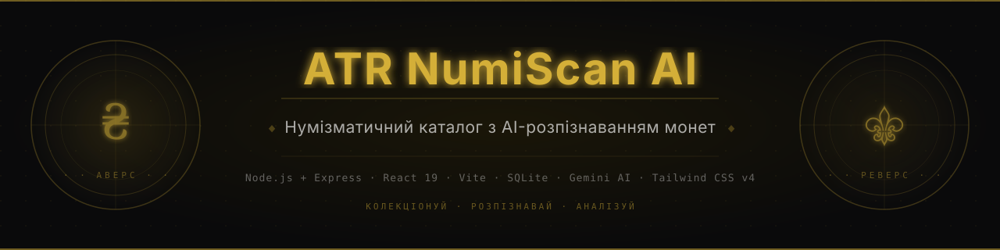

<p align="center">
  
</p>

<p align="center">
  
  
  
  
  
  
  
</p>

<p align="center">
  Персональний нумізматичний каталог з AI-розпізнаванням монет.<br/>
  Підтримує Google Gemini, OpenAI GPT, LM Studio та Ollama (локальні моделі).<br/>
  Завантаж фото — отримай повний опис, країну, метал, рік карбування та ринкову вартість.
</p>

---

## Можливості

### AI-розпізнавання
- **Мультипровайдерна підтримка** — Google Gemini, OpenAI GPT-4o/4.1/o4, LM Studio (локально на хості), Ollama (локально на хості)
- **Розпізнавання по двох фото** — аверс + реверс одночасно для вищої точності
- **Автокорекція порядку** — AI визначає і виправляє переплутані аверс/реверс автоматично
- **Закріплені моделі** — до 6 вибраних моделей виводяться кнопками в інтерфейсі, вибір зберігається між сесіями
- **Ручне введення моделей Ollama** — поле для назв моделей (зокрема хмарних `minimax-m3:cloud`), що не відображаються у `/api/tags`; зберігаються між сесіями
- **Batch-пошук тиражів** — масовий запит характеристик монет через Numista API

### Колекція
- **Перевірка дублів** — попередження при спробі додати вже наявну монету; дублі позначаються рожевою категорією
- **Детальна картка монети** — редагування всіх полів, нотатки, збільшення фото, кольоровий бейдж категорії; ID монети в заголовку (клік → копіювання)
- **Кольорові категорії** — 10 міток для власної класифікації; верхній бордер картки відображає колір категорії
- **Лайтбокс** — перегляд фото: ←/→ або свайп (аверс/реверс), ↑/↓ або вертикальний свайп (між монетами), Enter → картка монети, Esc → повернення до лайтбоксу
- **Фільтрація** — за металом/сплавом та країною; фільтр по країні активується кліком на карту або список
- **Пагінація каталогу** — 60 монет на сторінку, навігація `Ctrl+→` / `Ctrl+←`
- **Ліниве завантаження зображень** — фото роздаються через URL-ендпоїнт, кешуються браузером

### Статистика та аналітика
- **Карта світу** — choropleth із градієнтним заповненням; клік по країні → фільтр у каталозі
- **Статистика колекції** — десятиліття, метали, країни, рідкість, грейди, категорії, фізичні характеристики
- **Прапори та ISO-коди** — 100+ країн, включно з історичними (СРСР, НДР, Кайзерейх тощо)

### Експорт і сервіс
- **PDF-каталог** — A4 з фото або без, з поточним фільтром бази
- **REST API** — повний доступ до каталогу ззовні

---

## Стек

| Шар | Технологія |
|---|---|
| Backend | Node.js + Express + TypeScript (`tsx`) |
| Frontend | React 19 + Vite 6 + Tailwind CSS v4 |
| База даних | SQLite (`sqlite3` async) |
| AI — хмара | Google Gemini API (`@google/genai`), OpenAI API (`openai`) |
| AI — локально | LM Studio / Ollama (OpenAI-compatible API) |
| Карта | `react-simple-maps` (choropleth) |
| PDF | `pdfkit` |

---

## Встановлення на Windows

**1.** Завантажте або клонуйте репозиторій:
```
git clone https://github.com/atr-ua/NumiScanAI.git
```

**2.** Запустіть `setup.bat`:

```
setup.bat
```

Скрипт автоматично:
- перевіряє наявність **Node.js 18+** (пропонує відкрити nodejs.org, якщо не знайдено)
- встановлює всі залежності (`npm install`)
- запитує **Gemini API ключ** (та опційно OpenAI і Numista ключі) і зберігає в `.env`
- створює ярлик **GemCoin** на робочому столі
- пропонує запустити відразу після встановлення

> Безкоштовний Gemini API ключ: [aistudio.google.com](https://aistudio.google.com)

### Запуск

Після встановлення — двічі клікніть **ярлик GemCoin** на робочому столі або запустіть `start.bat`.  
Сервер стартує на **http://localhost:3001**, браузер відкривається автоматично.

### Оновлення

```
update.bat
```

Скрипт:
- перевіряє наявність **Git** (пропонує встановити через winget, якщо не знайдено)
- показує список нових змін з GitHub
- зберігає локальні зміни (`git stash`) перед оновленням
- виконує `git pull` та автоматично запускає `npm install`, якщо змінився `package.json`

---

## Ручне встановлення (розробники / інші ОС)

**Вимоги:** Node.js 18+, Git

```bash
git clone https://github.com/atr-ua/NumiScanAI.git
cd NumiScanAI
npm install
```

Створіть файл `.env`:
```env
GEMINI_API_KEY=ваш_ключ          # обов'язково для Gemini
OPENAI_API_KEY=ваш_ключ          # необов'язково, для OpenAI GPT
NUMISTA_API_KEY=ваш_ключ         # необов'язково, для batch-пошуку тиражів

# Локальні провайдери (необов'язково, URL налаштовуються в UI)
LM_STUDIO_URL=http://localhost:1234
OLLAMA_URL=http://localhost:11434
```

Запустіть:
```bash
npm run dev
```

Сервер запускається на **http://localhost:3001**

---

## Локальні AI (LM Studio / Ollama)

Якщо застосунок працює у VM або на іншій машині — вкажіть IP хоста у вкладці **Сервіс**.  
Ollama за замовчуванням слухає лише `127.0.0.1`; для мережевого доступу потрібно:
```
OLLAMA_HOST=0.0.0.0 ollama serve
```
LM Studio: увімкніть *"Serve on local network"* у налаштуваннях сервера.

---

## REST API

| Метод | URL | Опис |
|---|---|---|
| `GET` | `/api/coins` | Список усіх монет (без фото, швидко) |
| `GET` | `/api/coins/:id` | Повні дані монети з фотографіями |
| `GET` | `/api/coins/:id/image/:side` | Фото монети (`obverse` або `reverse`) як бінарний файл |
| `POST` | `/api/coins` | Зберегти або оновити монету (upsert) |
| `POST` | `/api/coins/:id/swap-images` | Поміняти аверс і реверс місцями |
| `POST` | `/api/coins/reorder` | Зберегти новий порядок монет |
| `DELETE` | `/api/coins/:id` | Видалити монету |
| `POST` | `/api/recognize-coin` | AI-розпізнавання по base64-фото |
| `POST` | `/api/batch-mintage` | Масовий пошук тиражів через Numista |
| `GET` | `/api/gemini-models` | Список доступних Gemini-моделей |
| `GET` | `/api/lm-studio-models` | Список моделей LM Studio |
| `GET` | `/api/ollama-models` | Список моделей Ollama |
| `POST` | `/api/export/pdf` | Генерація PDF-каталогу |
| `GET` | `/api/version` | Версія сервера |

---

## Структура проекту

```
├── setup.bat / setup.ps1           # Встановлення: Node.js, npm, .env, ярлик
├── start.bat                       # Запуск сервера + автовідкриття браузера
├── update.bat / update.ps1         # Оновлення з GitHub (git pull + npm install)
├── server.ts                       # Express сервер + Vite middleware + AI API
├── src/
│   ├── App.tsx                     # Головний компонент, стан, розпізнавання
│   ├── db.ts                       # SQLite шар (initDb, CRUD)
│   ├── types.ts                    # TypeScript типи
│   ├── components/
│   │   ├── CoinDatabase.tsx        # Каталог з пагінацією та фільтрами
│   │   ├── CoinUpload.tsx          # Завантаження фото, камера
│   │   ├── CollectionAnalytics.tsx # Статистика, графіки, карта
│   │   ├── WorldMap.tsx            # Choropleth карта з кліком-фільтром
│   │   ├── CountryFlag.tsx         # Прапори країн (SVG + emoji fallback)
│   │   └── ServicePage.tsx         # Налаштування AI, PDF-експорт, REST-документація
│   └── utils/
│       ├── countryUtils.ts         # Маппінг країн → ISO-коди / прапори (100+ країн)
│       ├── categoryUtils.ts        # 10 кольорових категорій
│       └── coinUtils.ts            # Допоміжні функції (fixTitleWithYear тощо)
├── coins.db                        # SQLite база (створюється автоматично, в .gitignore)
└── .env                            # API-ключі (не комітити!)
```

---

## Ліцензія

Apache 2.0 © Andrii (ATR) Tarasenko
